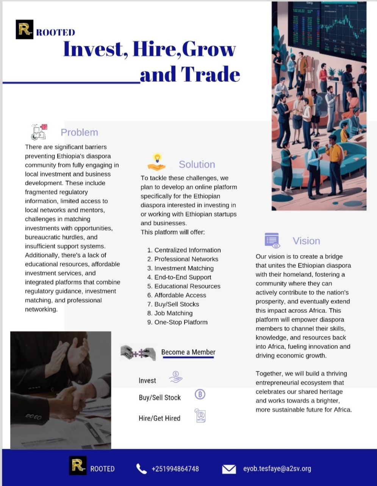

# Rooted-frontend-project

  <!-- Add space between images -->

  <!-- Add more space if needed -->

  <!-- Add space between images -->

  <!-- Add space between images -->

# One-Pager   
Rooted is an online platform that bridges the Ethiopian diaspora with investment and business opportunities, offering centralized information, professional networks, investment matching, and educational resources to fuel innovation and growth.   

